## AR/MR技术

### Vuforia配置过程

#### 创建证书

官网注册账号后注册(命名随意)


然后进入证书项可以获取密钥

#### 创建目标数据库

在Develop界面选择Target Manager，创建一个数据库，可以对所有Target及其特征树进行管理和保存。

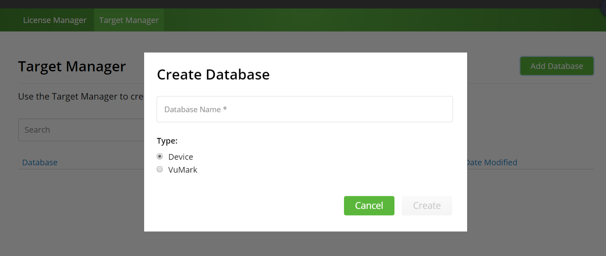

添加一个识别目标

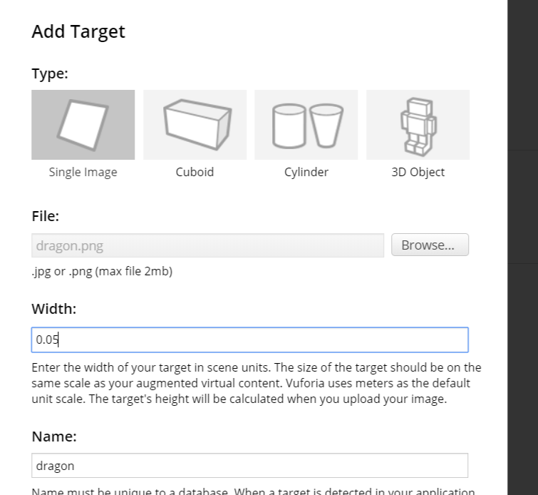

添加成功

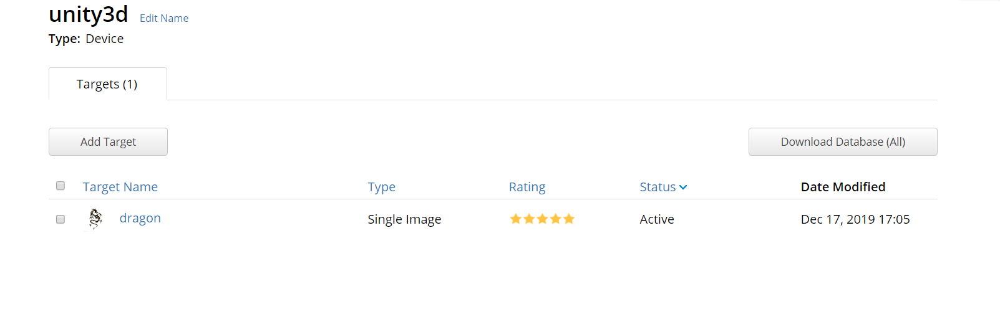

下载，要选择unity editor

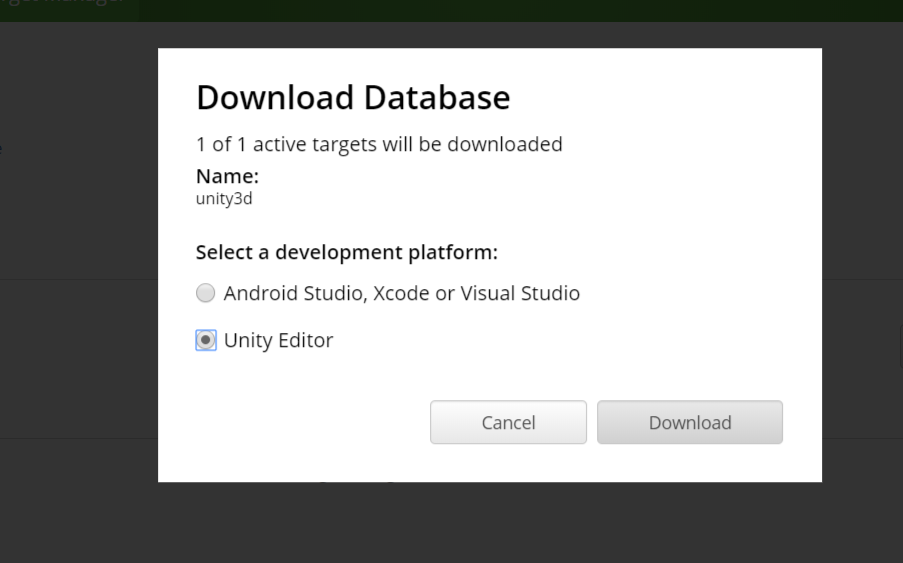

然后在unity就可以直接导入了

### 安装vuforia扩展包

版本不太一样参考了其他同学的博客

需要在File-BuildSetting-PlayerSetting的Inspector里设置一下

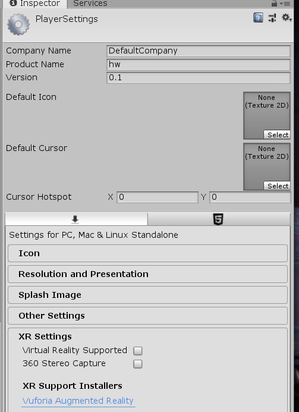

下面XR Support Installers有个Vuforia Augmented Reality

点击后即可下载安装包(外网下载比较慢)

安装到unity的目录，安装过程退出uinty

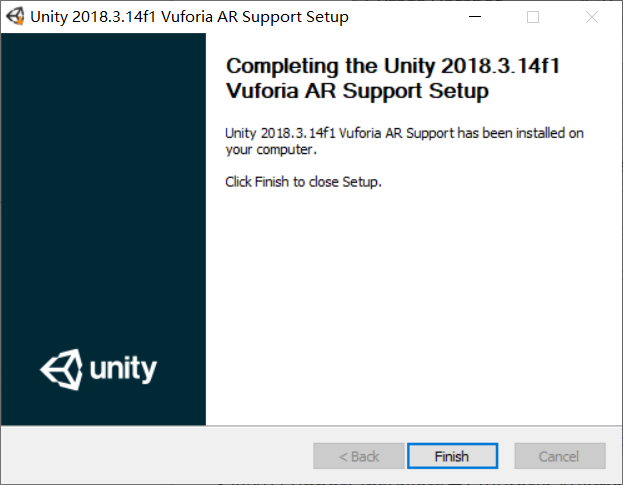

此时再重新打开PlayerSetting的XRSetting就变成下面这样可选的了

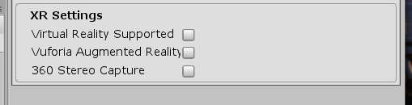

打勾第二个

导入一个AR Camera

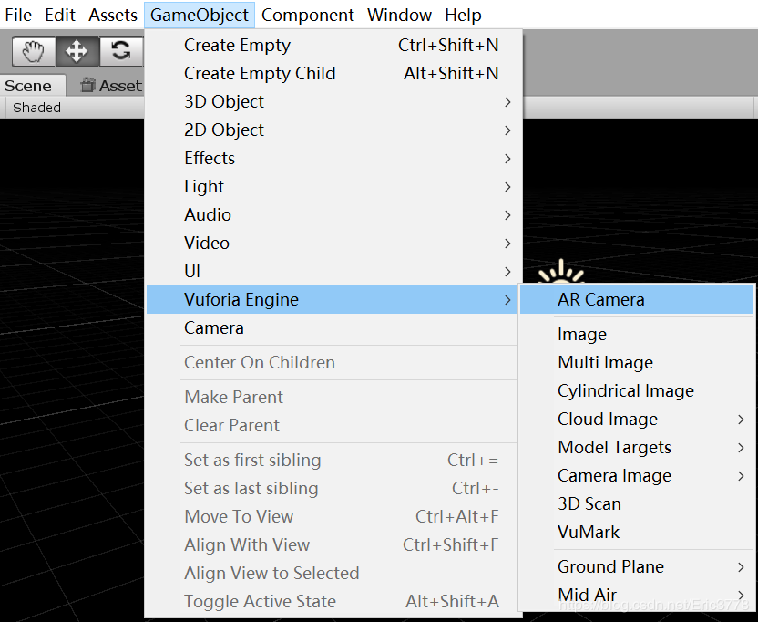

进入ARCamera的Inspector，Open Vuforia Configuration

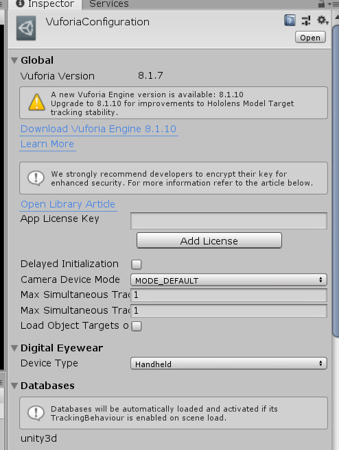

在这个界面中的App License Key位置粘贴上我们前面得到的证书密钥，完成这一步之后我们才能开始使用Vuforia.

### 图片识别与建模

选择Gameobject->Vuforia Engine->Camera Image->Camera Image Target添加一个ImageTarget，然后在如下设置界面中将Type设置为Predefined，这时系统会自动选择之前已经导入的3D_Course数据库中的dragon图片。
然后简单的在Image Target的子节点中创建一个cube，运行看看效果(我是电脑的前摄像头)

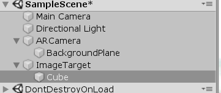

在手机上显示dragon图片

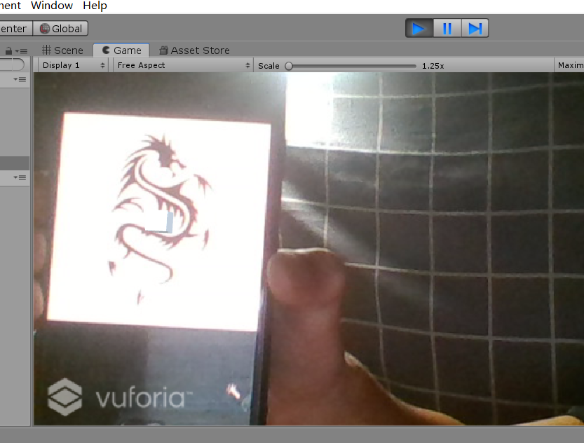

可以看到有个小立方体随着图片的移动而移动

### 虚拟按键小游戏

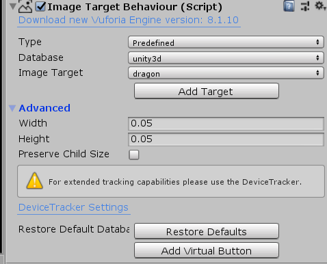

添加Vitual Buton(在ImageTarget的Inspector里)

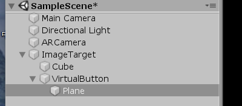

为按钮添加点击事件改变方块的颜色

```csharp
using System.Collections;
using System.Collections.Generic;
using UnityEngine;
using System;
using Vuforia;

public class button : MonoBehaviour, IVirtualButtonEventHandler
{
    // Start is called before the first frame update
    public VirtualButtonBehaviour[] vbs;
    public GameObject cub;
    public GameObject but;
    public Color[] colors;
    public int color_index;

    void Start()
    {
        vbs = GetComponentsInChildren<VirtualButtonBehaviour>();
        for (int i = 0; i < vbs.Length; i++)
        {
            vbs[i].RegisterEventHandler(this);
        }
        color_index = 1;
        colors = new Color[4];
        colors[0] = Color.white;
        colors[1] = Color.red;
        colors[2] = Color.blue;
        colors[3] = Color.green;
        cub = GameObject.Find("ImageTarget/Cube");
        but = GameObject.Find("ImageTarget/VirtualButton/Plane");
    }

    // Update is called once per frame
    void Update()
    {
       
       
    }

    public void OnButtonPressed(VirtualButtonBehaviour vb)
    {
        but.GetComponent<Renderer>().material.color = Color.red;
        if (color_index == 4) color_index = 0;
        cub.GetComponent<Renderer>().material.color = colors[color_index++];
    }

    public void OnButtonReleased(VirtualButtonBehaviour vb)
    {
        but.GetComponent<Renderer>().material.color = Color.white;
    }
}

```

运行测试效果就好了！

