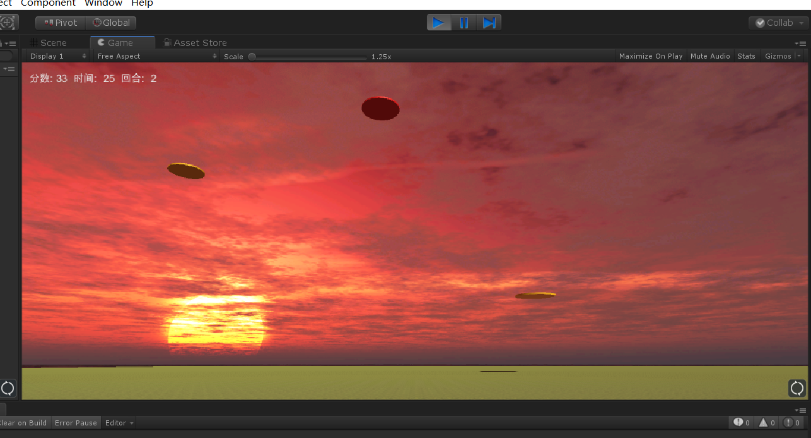
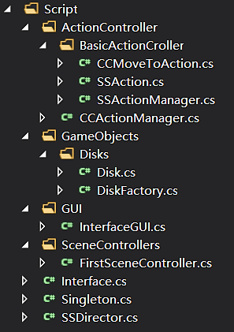

## Unity: 打飞碟简单版

### 游戏规则

- 一共有三个回合，随着回合增加，单位时间出现的飞碟数合飞碟的速度都会增加
- 分数由玩家点击的飞碟颜色决定，黑色3分，红色2分，黄色1分
- 每个回合有20个飞碟
- 没有失败的条件，最后看分数多少

### 游戏场景



### 代码组织结构

代码结构



在老师给的框架下做一些扩展即可

### 代码

**Disk.cs** 飞碟的属性脚本

```csharp
using System.Collections;
using System.Collections.Generic;
using UnityEngine;

public class Disk : MonoBehaviour {
    //初始化的位置
    public Vector3 StartPoint { get { return gameObject.transform.position; } set { gameObject.transform.position = value; } }
    public Color color { get { return gameObject.GetComponent<Renderer>().material.color; } set { gameObject.GetComponent<Renderer>().material.color = value; } }
    //初始速度
    public float speed { get;set; }
    //方向
    public Vector3 Direction { get { return Direction; } set { gameObject.transform.Rotate(value); } }
    public int score;   //后面没用到
}

```

**DiskFactory.cs** 飞碟工厂，管理飞碟的产生、销毁

```csharp
using System.Collections;
using System.Collections.Generic;
using UnityEngine;

public class DiskFactory { 
    public GameObject diskPrefab;
    public static DiskFactory DF = new DiskFactory();

    private Dictionary<int, Disk> used = new Dictionary<int, Disk>();//used是用来保存正在使用的飞碟 
    private List<Disk> free = new List<Disk>();//free是用来保存未激活的飞碟 

    private DiskFactory()
    {
        diskPrefab = GameObject.Instantiate<GameObject>(Resources.Load<GameObject>("Prefabs/disk"));//获取预制的游戏对象
        diskPrefab.AddComponent<Disk>();
        diskPrefab.SetActive(false);
    }

    //更新used和free列表里的飞碟
    public void FreeDisk()
    {
        foreach (Disk x in used.Values)
        {
            if (!x.gameObject.activeSelf)
            {
                free.Add(x);
                used.Remove(x.GetInstanceID());
                return;
            }
        }
    }

    //获取一个free的飞碟
    public Disk GetDisk(int round)  
    {
        FreeDisk();
        GameObject newDisk = null;
        Disk disk;
        if (free.Count > 0)
        {
            //从之前生产的Disk中拿出可用的
            newDisk = free[0].gameObject;
            free.Remove(free[0]);
        }
        else
        {
            //克隆预制对象，生产新Disk
            newDisk = GameObject.Instantiate<GameObject>(diskPrefab, Vector3.zero, Quaternion.identity);
        }
        newDisk.SetActive(true);
        disk = newDisk.AddComponent<Disk>();    //添加属性脚本

        int initCase;
        initCase = Random.Range(0, 5);
        /** 
         * 根据回合数来生成相应的飞碟,难度逐渐增加。
         */
        float initSpeed;
        if (round == 1)
        {
            initSpeed = Random.Range(40, 60);
        }
        else if (round == 2)
        {
            initSpeed = Random.Range(60, 90);
        }
        else {
            initSpeed = Random.Range(90, 120);
        } 
        //根据initCase的不同设计飞碟的颜色、初速度、初始化位置等
        switch (initCase)  
        {  
             
            case 0:  
                {  
                    disk.color = Color.yellow;  
                    disk.speed = initSpeed;  
                    float RanX = UnityEngine.Random.Range(-1f, 1f) < 0 ? -1 : 1;  
                    disk.Direction = new Vector3(RanX, 1, 0);
                    disk.StartPoint = new Vector3(Random.Range(-130, -110), Random.Range(30,90), Random.Range(110,140));
                    break;  
                }  
            case 1:  
                {  
                    disk.color = Color.red;  
                    disk.speed = initSpeed + 10;  
                    float RanX = UnityEngine.Random.Range(-1f, 1f) < 0 ? -1 : 1;  
                    disk.Direction = new Vector3(RanX, 1, 0);
                    disk.StartPoint = new Vector3(Random.Range(-130, -110), Random.Range(30, 80), Random.Range(110, 130));
                    break;  
                }  
            case 2:  
                {  
                    disk.color = Color.black;  
                    disk.speed = initSpeed + 15;  
                    float RanX = UnityEngine.Random.Range(-1f, 1f) < 0 ? -1 : 1;  
                    disk.Direction = new Vector3(RanX, 1, 0);
                    disk.StartPoint = new Vector3(Random.Range(-130,-110), Random.Range(30, 70), Random.Range(90, 120));
                    break;  
                }
            case 3:
                {
                    disk.color = Color.yellow;
                    disk.speed = -initSpeed;
                    float RanX = UnityEngine.Random.Range(-1f, 1f) < 0 ? -1 : 1;
                    disk.Direction = new Vector3(RanX, 1, 0);
                    disk.StartPoint = new Vector3(Random.Range(130, 110), Random.Range(30, 90), Random.Range(110, 140));
                    break;
                }
            case 4:
                {
                    disk.color = Color.red;
                    disk.speed = -initSpeed - 10;
                    float RanX = UnityEngine.Random.Range(-1f, 1f) < 0 ? -1 : 1;
                    disk.Direction = new Vector3(RanX, 1, 0);
                    disk.StartPoint = new Vector3(Random.Range(130, 110), Random.Range(30, 80), Random.Range(110, 130));
                    break;
                }
            case 5:
                {
                    disk.color = Color.black;
                    disk.speed = -initSpeed - 15;
                    float RanX = UnityEngine.Random.Range(-1f, 1f) < 0 ? -1 : 1;
                    disk.Direction = new Vector3(RanX, 1, 0);
                    disk.StartPoint = new Vector3(Random.Range(130, 110), Random.Range(30, 70), Random.Range(90, 120));
                    break;
                }
        }

        if (disk.color == Color.black) disk.score = 3;
        else if (disk.color == Color.red) disk.score = 2;
        else disk.score = 1;
        used.Add(disk.GetInstanceID(), disk); //添加到使用队列里
        disk.name = disk.GetInstanceID().ToString();
        return disk;  
    }
}

```

**CCFlyAction.cs** 具体的飞行动作

```csharp
using System.Collections;
using System.Collections.Generic;
using UnityEngine;


//飞行的动作，由上个游戏的CCMoveToAction改动过来的
public class CCFlyAction : SSAction
{
    //速度分解为x和y方向，y方向初始为0
    public float speedx;
    public float speedy = 0;

    private CCFlyAction() { }
    //单例模式，给定初始的x方向速度
    public static CCFlyAction getAction(float speedx)
    {
        CCFlyAction action = CreateInstance<CCFlyAction>();
        action.speedx = speedx;
        return action;
    }

    //运动
    public override void Update()
    {
        // dx = vt
        float deltax = speedx * Time.deltaTime;
        // dy = yt + 0.5at^2
        float deltay = -speedy * Time.deltaTime + (float)-0.5 * 10 * Time.deltaTime * Time.deltaTime;
        this.transform.position += new Vector3(deltax, deltay,0);
        // y' = y + at
        speedy += 10*Time.deltaTime;
        //当飞碟的位置的y坐标小于阈值，认为消失在用户视野中，执行销毁
        if (transform.position.y <= 1)
        {
            destroy = true;
            CallBack.SSActionCallback(this);
        }
    }

    public override void Start()
    {

    }
}
```

**Interfaces.cs**：接口定义，主要修改**UserAction**接口

```csharp
using System.Collections;
using System.Collections.Generic;
using UnityEngine;

namespace Interfaces
{
    public interface ISceneController
    {
        void LoadResources();
    }

    public interface UserAction
    {
        void Hit(Vector3 pos);      //鼠标点击
        void Restart();             //开始和重新开始都一样
        int GetScore();             
        bool RoundStop();           //最后的回合结束
        int GetRound();             
    }   

    public enum SSActionEventType : int { Started, Completed }

    public interface SSActionCallback
    {
        void SSActionCallback(SSAction source);
    }
}
```

**FirstSceneController.cs**：挂在空项目上的脚本，场景控制器

```csharp
using System.Collections;
using System.Collections.Generic;
using UnityEngine;
using Interfaces;

public class FirstSceneController : MonoBehaviour, ISceneController, UserAction
{
    int score = 0;      //分数
    int round = 1;      //回合，设置了3个
    int producedDiskNum = 0;    //每回合已经产生的飞碟数目
    bool start = false;
    CCActionManager Manager;
    DiskFactory DF;

    void Awake()
    {
        SSDirector director = SSDirector.getInstance();
        director.currentScenceController = this;
        DF = DiskFactory.DF;
        Manager = GetComponent<CCActionManager>();
    }

    // Use this for initialization
    void Start () {
        
    }

    // Update is called once per frame
    int count = 0;
	void Update () {
        //val帧产生一个飞碟
        int val;
        switch (round)
        {
            case 1:
                val = Random.Range(60, 80);
                break;
            case 2:
                val = Random.Range(45, 60);
                break;
            default:
                val = 40;
                break;
        }
        if(start)
        {
            count++;
            if (count >= val)    //val帧一个飞碟
            {
                count = 0;

                if(DF == null)
                {
                    Debug.LogWarning("DF is NUll!");
                    return;
                }
                producedDiskNum++;
                Disk d = DF.GetDisk(round);
                Manager.MoveDisk(d);
                if (producedDiskNum == 15) //15个飞碟进入下一个回合
                {
                    round++;
                    producedDiskNum = 0;
                }
            }
        }
	}

    public void LoadResources()
    {
        
    }

    public void Hit(Vector3 pos)
    {
        Ray ray = Camera.main.ScreenPointToRay(pos);

        RaycastHit[] hits;
        hits = Physics.RaycastAll(ray);
        for (int i = 0; i < hits.Length; i++)
        {
            RaycastHit hit = hits[i];
            //根据颜色加分
            if (hit.collider.gameObject.GetComponent<Disk>() != null)
            {
                Color c = hit.collider.gameObject.GetComponent<Renderer>().material.color;
                if (c == Color.yellow) score += 1;
                if (c == Color.red) score += 2;
                if (c == Color.black) score += 3;
                
                hit.collider.gameObject.transform.position = new Vector3(0, -5, 0);
            }

        }
    }

    public int GetScore()
    {
        return score;
    }
    
    //初始化各变量
    public void Restart()
    {
        score = 0;
        round = 1;
        start = true;
    }
    //到了第三回合要判断是否结束
    public bool RoundStop()
    {
        if (round > 3)
        {
            start = false;
            return Manager.IsAllFinished();//是否还有飞碟留在used列表里
        }
        else return false;
    }
    public int GetRound()
    {
        return round;
    }
}
```

**InterfaceGUI.cs**：挂在相机的脚本，负责管理与玩家的界面管理

```csharp
using System.Collections;
using System.Collections.Generic;
using UnityEngine;
using Interfaces;
using UnityEngine.UI;

//挂在相机的脚本
public class InterfaceGUI : MonoBehaviour {
    UserAction userAction;
    bool isPlaying = false;
    float S;
    int round = 1;
    // Use this for initialization
    void Start () {
        userAction = SSDirector.getInstance().currentScenceController as UserAction;
        S = Time.time;
    }

    private void OnGUI()
    {
        if(!isPlaying) S = Time.time;
        //分数、时间、回合
        string text = "分数: " + userAction.GetScore().ToString() + "  时间:  " + ((int)(Time.time - S)).ToString() + "  回合:  " + round;
        GUI.Label(new Rect(10, 10, Screen.width, 50),text);

        if (!isPlaying && GUI.Button(new Rect(Screen.width / 2 - 75, Screen.height / 2 - 25, 150, 50), "开始游戏"))
        {
            S = Time.time;
            isPlaying = true;
            userAction.Restart();   //点击开始游戏，FirstSceneController开始游戏
        }
        if (isPlaying)
        {
            round = userAction.GetRound();
            if (Input.GetButtonDown("Fire1"))
            {
                //把鼠标点击的位置传给FirstScenceController，处理点击事件
                Vector3 pos = Input.mousePosition;
                userAction.Hit(pos);

            }
            if (round > 3)  //round>3要等待飞碟都用完了
            {
                round = 3;
                if (userAction.RoundStop())
                {
                    isPlaying = false;
                }
            }
        }
    }

```

其他类基本没有变化

----

### 总结

本次代码因为规则的设计比较简单而简单，其实可以加上生命之之类的功能。

[Github传送门](https://github.com/chenjb58/3DGame)

