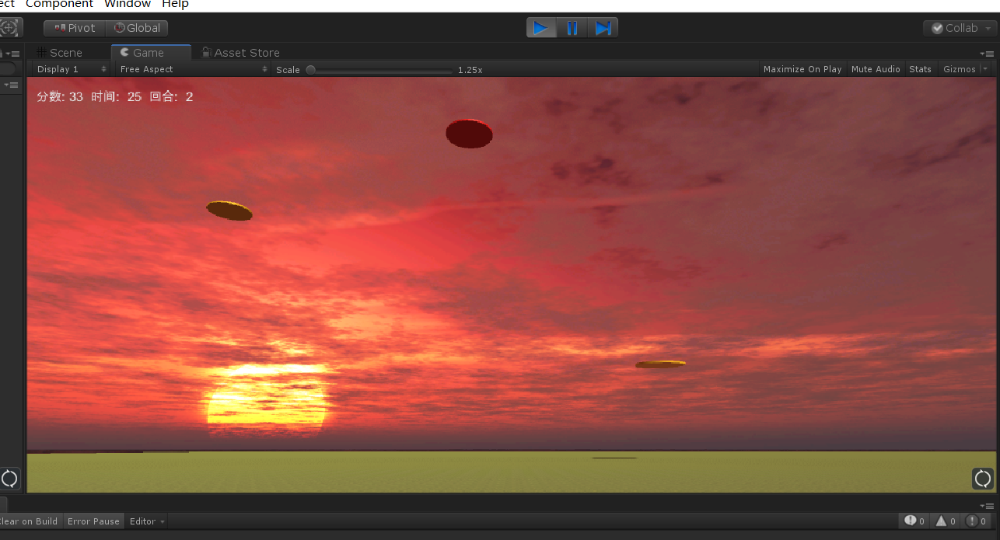
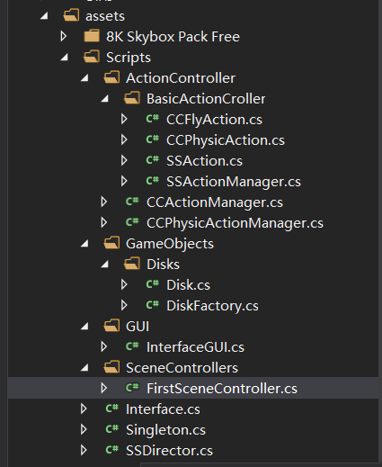

## Unity: 打飞碟简单版

### 游戏规则

- 一共有三个回合，随着回合增加，单位时间出现的飞碟数合飞碟的速度都会增加
- 分数由玩家点击的飞碟颜色决定，黑色6分，红色4分，黄色2分
- 每个回合有20个飞碟
- 没有失败的条件，最后看分数多少

### 游戏场景



### 代码组织结构

代码结构有所更新



在上一次的基础上把CCFlyAction换成CCPhysicAction，CCActionManager 换成CCPhysicActionManager即可

### 代码改动

**Interfaces.cs**: 添加了IAction接口，实际上就是Manger里的函数

```csharp
using System.Collections;
using System.Collections.Generic;
using UnityEngine;

namespace Interfaces
{
    public interface ISceneController
    {
        void LoadResources();
    }

    public interface UserAction
    {
        void Hit(Vector3 pos);      //鼠标点击
        void Restart();             //开始和重新开始都一样
        int GetScore();             
        bool RoundStop();           //最后的回合结束
        int GetRound();             
    }   

    public enum SSActionEventType : int { Started, Completed }

    public interface SSActionCallback
    {
        void SSActionCallback(SSAction source);
    }

    public interface IActionManager
    {
        void MoveDisk(Disk disk);
        bool IsAllFinished(); //主要为了防止游戏结束时场景还有对象但是GUI按钮已经加载出来
    }
}
```

**CCPhysicAction.cs**： 新增的类，代替CCFlyAction执行飞行运动，刚体

```csharp
using System.Collections;
using System.Collections.Generic;
using UnityEngine;

public class CCPhysicAction : SSAction
{
    public float speedx;
    // Use this for initialization
    public override void Start()
    {
        //添加刚体组件
        if (!this.gameObject.GetComponent<Rigidbody>())
        {
            this.gameObject.AddComponent<Rigidbody>();
        }
        //添加重力
        this.gameObject.GetComponent<Rigidbody>().AddForce(Vector3.up * 9.8f * 0.6f, ForceMode.Acceleration);
        //设置初速度
        this.gameObject.GetComponent<Rigidbody>().AddForce(new Vector3(speedx, 0, 0), ForceMode.VelocityChange);
    }

    private CCPhysicAction()
    {

    }
    public static CCPhysicAction getAction(float speedx)
    {
        CCPhysicAction action = CreateInstance<CCPhysicAction>();
        action.speedx = speedx;
        return action;
    }

    // Update is called once per frame
    override public void Update()
    {
        if (transform.position.y <= 3)
        {
            Destroy(this.gameObject.GetComponent<Rigidbody>());//如果不移除刚体属性会导致前面添加的速度属性累积。
            destroy = true;
            CallBack.SSActionCallback(this);
        }
    }
}

```

**CCPhysicActionManager.cs**: 新增的类，代替CCActionManager对动作进行管理(合CCAction一样，只是便于区分，继承了IActionManager接口)

```csharp
using System.Collections;
using System.Collections.Generic;
using UnityEngine;
using Interfaces;

//具体管理飞行动作的管理器
public class CCActionManager : SSActionManager, SSActionCallback, IActionManager
{
    int count = 0;//记录所有在移动的碟子的数量
    public SSActionEventType Complete = SSActionEventType.Completed;

    public void MoveDisk(Disk Disk)
    {
        count++;
        Complete = SSActionEventType.Started;
        CCFlyAction action = CCFlyAction.getAction(Disk.speed);
        addAction(Disk.gameObject, action, this);
    }

    public void SSActionCallback(SSAction source) //运动事件结束后的回调函数
    {
        count--;
        Complete = SSActionEventType.Completed;
        source.gameObject.SetActive(false);
    }

    public bool IsAllFinished() //主要为了防止游戏结束时场景还有对象但是GUI按钮已经加载出来
    {
        if (count == 0) return true;
        else return false;
    }
}
```

最后再把FirstSceneController里的Manager类型修改为IActionManager，并初始化即可。

```csharp
using System.Collections;
using System.Collections.Generic;
using UnityEngine;
using Interfaces;

public class FirstSceneController : MonoBehaviour, ISceneController, UserAction
{
    int score = 0;      //分数
    int round = 1;      //回合，设置了3个
    int producedDiskNum = 0;    //每回合已经产生的飞碟数目
    bool start = false;
    IActionManager Manager;
    DiskFactory DF;

    void Awake()
    {
        SSDirector director = SSDirector.getInstance();
        director.currentScenceController = this;
        DF = DiskFactory.DF;
        Manager = this.gameObject.AddComponent<CCPhysicActionManager>() as IActionManager;
    }

    // Use this for initialization
    void Start () {
        
    }

    // Update is called once per frame
    int count = 0;
	void Update () {
        //val帧产生一个飞碟
        int val;
        switch (round)
        {
            case 1:
                val = Random.Range(60, 80);
                break;
            case 2:
                val = Random.Range(45, 60);
                break;
            default:
                val = 40;
                break;
        }
        if(start)
        {
            count++;
            if (count >= val)    //val帧一个飞碟
            {
                count = 0;

                if(DF == null)
                {
                    Debug.LogWarning("DF is NUll!");
                    return;
                }
                producedDiskNum++;
                Disk d = DF.GetDisk(round);
                Manager.MoveDisk(d);
                if (producedDiskNum == 20) //20个飞碟进入下一个回合
                {
                    round++;
                    producedDiskNum = 0;
                }
            }
        }
	}

    public void LoadResources()
    {
            
    }


    public void Hit(Vector3 pos)
    {
        Ray ray = Camera.main.ScreenPointToRay(pos);

        RaycastHit[] hits;
        hits = Physics.RaycastAll(ray);
        for (int i = 0; i < hits.Length; i++)
        {
            RaycastHit hit = hits[i];
            //根据颜色加分
            if (hit.collider.gameObject.GetComponent<Disk>() != null)
            {
                Color c = hit.collider.gameObject.GetComponent<Renderer>().material.color;
                if (c == Color.yellow) score += 1;
                if (c == Color.red) score += 2;
                if (c == Color.black) score += 3;
               // score += hit.collider.gameObject.GetComponent<Disk>().score;    //不清楚为什么这样分数是0.。。
                //把y更改到阈值以下，工厂会判断为free
                hit.collider.gameObject.transform.position = new Vector3(0, -5, 0);
            }

        }
    }

    public int GetScore()
    {
        return score;
    }
    
    //初始化各变量
    public void Restart()
    {
        score = 0;
        round = 1;
        start = true;
    }
    //到了第三回合要判断是否结束
    public bool RoundStop()
    {
        if (round > 3)
        {
            start = false;
            return Manager.IsAllFinished();//是否还有飞碟留在used列表里
        }
        else return false;
    }
    public int GetRound()
    {
        return round;
    }
}
```

其他的代码没有什么改动

----

### 总结

本次代码为物体添加了刚体组件，让物体自己动起来。因为添加了刚体，如果屏幕上的飞碟太多有可能会碰撞，上一次代码会直接传过去。

[Github传送门](https://github.com/chenjb58/3DGame)

