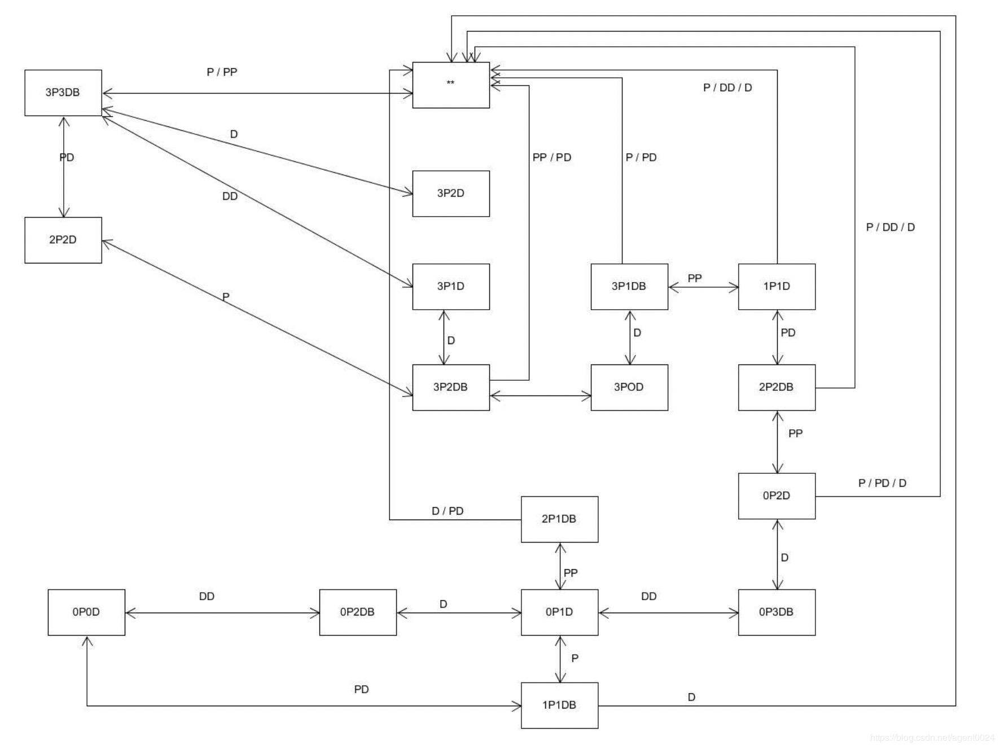

# P&D 过河游戏智能帮助实现

[github]( https://github.com/chenjb58/3DGame )

### 状态图

状态图课件有

  

 状态图(Statechart Diagram)是描述一个实体基于事件反应的动态行为，显示了该实体如何根据当前所处的状态对不同的事件做出反应。 

可以通过枚举类型表示不同的状态

```csharp
private enum Boataction {empty, P, D, PP, DD, PD }
//P：船运载一个牧师
//D：船运载一个恶魔
//PP：船运载两个牧师
//DD：船运载两个恶魔
//PD：船运载一个牧师，一个恶魔
```

再加上左右岸的牧师、魔鬼人数以及船上人数等信息，根据状态图确定下一个动作是什么。

### 图数据的代码表示

- **成员变量**

```csharp
public static AutoMove autoMove = new AutoMove();
public FirstController firstScene;
private int fromDevilNum;
private int fromPriestNum;
private int BoatCoast; // -1 -> left, 1 -> right.
//P：船运载一个牧师
//D：船运载一个恶魔
//PP：船运载两个牧师
//DD：船运载两个恶魔
//PD：船运载一个牧师，一个恶魔
private enum Boataction {empty, P, D, PP, DD, PD }
private bool isFinished = true;     //动作是否执行完成
private Boataction nextState;
//count执行步骤(0-4)
//0：初始 1：上了一个人 2：上了2个人 3：移动船 4：下船
private int count = 0;
//num表示船上的人数
private int num = 0;
```

- **获取下一状态**

没有什么算法可言。。根据状态图做。可以用节点跟链表做状态图，或者用邻接矩阵表示状态。为了方便直接用枚举类型。

```csharp
 //根据状态图设置nextState
    private Boataction getNext()
    {
        Boataction next = Boataction.empty;
        if (BoatCoast == 1)
        {
            if (fromDevilNum == 3 && fromPriestNum == 3)//3P3DB
            {
                next = Boataction.PD;
            }
            else if (fromDevilNum == 2 && fromPriestNum == 3)//3P2DB
            {
                next = Boataction.DD;
            }
            else if (fromDevilNum == 1 && fromPriestNum == 3)//3P1DB
            {
                next = Boataction.PP;
            }
            else if (fromDevilNum == 2 && fromPriestNum == 2)//2P2DB
            {
                next = Boataction.PP;
            }
            else if (fromDevilNum == 3 && fromPriestNum == 0)//3DB
            {
                next = Boataction.DD;
            }
            else if (fromDevilNum == 1 && fromPriestNum == 1)//1P1DB
            {
                next = Boataction.PD;
            }
            else if (fromDevilNum == 2 && fromPriestNum == 0)//2DB
            {
                next = Boataction.D;
            }
            else if (fromDevilNum == 1 && fromPriestNum == 2)//2P1DB
            {
                next = Boataction.P;
            }
            else if (fromDevilNum == 2 && fromPriestNum == 1)//1P2DB
            {
                next = Boataction.P;
            }
            else if (fromDevilNum == 1 && fromPriestNum == 0)//1DB
            {
                next = Boataction.D;
            }
            else if(fromDevilNum == 3 && fromPriestNum == 2)//2P3DB
            {
                next = Boataction.D;
            }
            else next = Boataction.empty;
        }
        else
        {
            if (fromDevilNum == 2 && fromPriestNum == 2)//2P2D
            {
                next = Boataction.empty;
            }
            else if (fromDevilNum == 1 && fromPriestNum == 3)//3P1D
            {
                next = Boataction.empty;
            }
            else if (fromDevilNum == 2 && fromPriestNum == 3)//3P2D
            {
                next = Boataction.D;
            }
            else if (fromDevilNum == 0 && fromPriestNum == 3)//3P
            {
                next = Boataction.empty;
            }
            else if (fromDevilNum == 1 && fromPriestNum == 1)//1P1D
            {
                next = Boataction.D;
            }
            else if (fromDevilNum == 2 && fromPriestNum == 0)//2D
            {
                next = Boataction.D;
            }
            else if (fromDevilNum == 1 && fromPriestNum == 0)//1D
            {
                next = Boataction.empty;
            }
            else next = Boataction.empty;
        }
        return next;
    }
```

- **自动操作**

```csharp
public void move()
{
    if (isFinished)
    {
        isFinished = false;	
        int[] fromCount = firstScene.fromCoast.GetobjectsNumber();
        fromPriestNum = fromCount[0];
        fromDevilNum = fromCount[1];
        BoatCoast = firstScene.boat.get_State();
        if (count == 0)
        {
            nextState = getNext();
            if ((int)nextState >= 3)
            {
                num = 2;
            }
            else if ((int)nextState > 0) num = 1;
            else num = 0;
            count++;
        }
        Debug.Log("next state is " + nextState);
        //根据状态自动操作
        DoAction();
        Debug.Log("count:" + count);
        Debug.Log("num:" + num);
    }
}
```

实现DoAction要实现牧师魔鬼的上下船动作以及船的左右移动动作。

