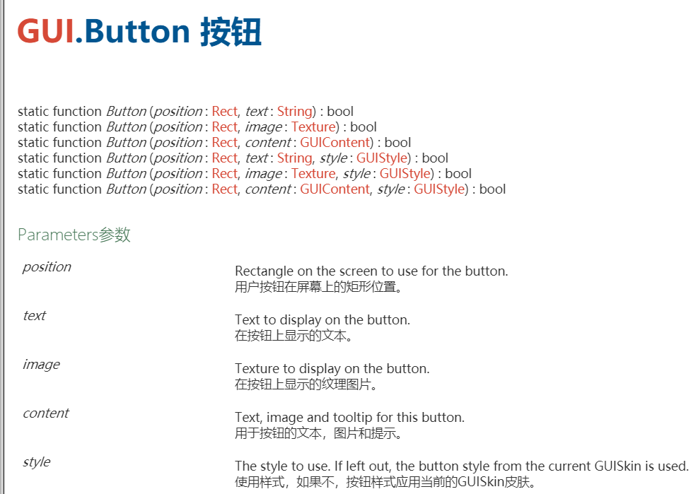

##离散仿真引擎基础

###简答题

####1. 解释 游戏对象（GameObjects） 和 资源（Assets）的区别与联系。

**区别**：游戏对象指的是游戏中的对象比如一个npc，一幕场景。游戏对象本身什么都不做，但是它是是组件的容器，可以通过添加组件使游戏对象具有某些特性从而成为游戏中的对象。 资源相当于一种模板，可以在asset store中下载（或者自己另外添加）来使用，包括图片、音频、视频、代码文件等。 
**联系**：资源可以作为模板创建对象；游戏对象可以作为资源保存。
--CSDN [ousuixin](https://me.csdn.net/ousuixin)

####2.下载几个游戏案例，分别总结资源、对象组织的结构（指资源的目录组织结构与游戏对象树的层次结构）

资源存放在asset文件夹里，按照文件类型分类我们可以把他们放到不同的文件夹，在unity客户端的project选项卡中可以看到这种组织结构：


对象通过层次结构来组织，通过整体-部分的关系构成层次结构，在unity的hierarchy选项卡中可以看到这种组织结构：


###3.编写一个代码，使用 debug 语句来验证MonoBehaviour基本行为或事件触发的条件

- 基本行为包括 Awake() Start() Update() FixedUpdate() LateUpdate()

- 常用事件包括 OnGUI() OnDisable() OnEnable()

  ```csharp
  using System.Collections;
  using System.Collections.Generic;
  using UnityEngine;
  
  public class NewBehaviourScript : MonoBehaviour
  {
  
      void Awake()
      {
          Debug.Log("execute function Awake");
      }
  
  
      void Start()
      {
          Debug.Log("execute function Start");
  
      }
    
      void Update()
      {
          Debug.Log("execute function update");
      }
  
      void FixedUpdate()
      {
          Debug.Log("execute function FixdUpdate");
      }
  
      void LateUpdate()
      {
          Debug.Log("execute function LateUpdate");
      }
  
      void OnGUI()
      {
          Debug.Log("execute function OnGUI");
      }
  
      void OnDisable()
      {
          Debug.Log("execute function OnDisable");
      }
  
      void OnEnable()
      {
          Debug.Log("execute function OnEnable");
      }
  }
  ```

在控制台可以看到相关信息：


- 查找脚本手册，了解GameObject，Transform，Component 对象

  - 分别翻译官方对三个对象的描述（Description）

    *GameObject是Unity Scenes中所有实例的基类，Transform指物体的位置、旋转和缩放，Component对象指所有附加到GameObeject的基类。*

  - 描述下图中 table 对象（实体）的属性、table 的 Transform 的属性、 table 的部件

    

    *table 的对象是 GameObject，第一个选择框是 activeSelf 属性，第二个文本框是对象名称，第三个选择框为static属性。*

    *Transform中的属性有位置(position)、旋转(rotation)、比例(scale)。*

    *table的部件有Transform，Mesh Filter，Box Collider，Mesh Renderer等。*

  - 用 UML 图描述 三者的关系（请使用 UMLet 14.1.1 stand-alone版本出图）

    

- 整理相关学习资料，编写简单代码验证以下技术的实现：

  - 查找对象

    ```csharp
    var obj = GameObject.Find(“table“);
    if(obj != null){
        Debug.Log("table is found!");
    }
    ```

  - 添加子对象

    ```csharp
    GameObject obj = GameObject.CreatePrimitive(PrimitiveType.Cube);
    obj.name = "a cube";
    obj.transform.position = new Vector3(0, 0, 2);
    obj.transform.parent = this.transform;
    ```

  - 遍历对象树

    ```csharp
    foreach (Transform child in transform)
    {
        Debug.Log("childname:"+child.name);
    }
    ```

  - 清除所有子对象

    ```csharp
    foreach (Transform child in transform)
    {
        GameObject.Destroy(child);
    }
    ```

- 资源预设（Prefabs）与 对象克隆 (clone)

  - 预设（Prefabs）有什么好处？

    *利用预设可以快速生成相同对象，而且修改预设就可以完成对生成对象的修改，就不需要在后期优化时在多个地方修改了，这样可以大大节省开发时间*

  - 预设与对象克隆 (clone or copy or Instantiate of Unity Object) 关系？

    *预设与克隆都能创建出相同的对象。预设创建出的对象与源预设还有联系，源预设修改了由预设创建的对象也会被修改（也就是说他们之间有某种东西链接着）。克隆出的对象与源对象不再有联系，克隆就仅仅是把原本对象复制了一份而已。*

  - 制作 table 预制，写一段代码将 table 预制资源实例化成游戏对象

  ```csharp
   GameObject prefabTable = (GameObject)Instantiate(Resources.Load("table"));
  ```

  ​       *要把预制的东西放到一个叫做resources的文件夹下才能被resource.load读到*

  

## 编程实践--井字棋

主要用到的API：

**GUI.Label():** 在屏幕上创建一个文本或纹理标签


**Rect()**:一个由x、y位置和width、height大小定义的二维矩形。


**GUI.Button()**:创建一个按钮，用户点击的时候触发一些事件。



代码如下，已附上相关注释：

```csharp
using System;
using System.Collections;
using System.Collections.Generic;
using UnityEngine;

public class chessboard : MonoBehaviour {
	private int cnt = 0;
	//map[i,j] = 0表示还没下， =1表示“X”的一方， =2表示”O"的一方
	private int[,] map = new int[3, 3];

	//初始化
	private void Start()
	{
		reset();
	}
	
	void OnGUI()
	{
		int res = Check();
		//X获胜
		if (res == 1)
		{
			GUI.Label(new Rect(40, 120, 90, 50), "X方赢了!");
		}
		//O获胜
		else if (res == 2)
		{
			GUI.Label(new Rect(40, 120, 90, 50), "O方赢了!");
		}
		//平局
		else if (cnt == 9)
		{
			GUI.Label(new Rect(40, 120, 100, 50), "平局！请重新开始！");
		}
		else
		{
			for (int i = 0; i < 3; i += 1)
			{
				for (int j = 0; j < 3; j += 1)
				{
					//没有被点击的矩形
					if (map[i, j] == 0)
					{
						//创建矩形，显示空字符串
						if (GUI.Button(new Rect(i * 50, j * 50, 50, 50), ""))
						{
							//点击触发事件，如果cnt为奇数将map[i,j]设置为2，否则设置为1
							if (cnt%2 == 0) map[i, j] = 1;
							else map[i, j] = 2;
							cnt = cnt + 1;
						}
					}
					//map[i,j]=1的Button显示X
					if (map[i, j] == 1)
					{
						GUI.Button(new Rect(i * 50, j * 50, 50, 50), "X");
					}
					//map[i,j]=2的Button显示O
					if (map[i, j] == 2)
					{
						GUI.Button(new Rect(i * 50, j * 50, 50, 50), "O");
					}
				}
			}
		}
		//创建reset的Button,点击重置
		if (GUI.Button(new Rect(25, 150, 100, 50), "reset"))
		{
			reset();
		}
	}

	//cnt=0,map[i,j] = 0
	private void reset()
	{
		for (int i = 0; i < 3; i += 1)
			for (int j = 0; j < 3; j += 1)
				map[i, j] = 0;
		
		cnt = 0;
	}

	//如果有一条线上都是同一个玩家的，返回序号，否则返回0
	private int Check()
	{
		//横向
		for (int i = 0; i < 3; ++i)
			if (map[i, 0] != 0 && map[i, 0] == map[i, 1] && map[i, 1] == map[i, 2])
				return map[i, 0];

		//纵向
		for (int j = 0; j < 3; ++j)
			if (map[0, j] != 0 && map[0, j] == map[1, j] && map[1, j] == map[2, j])
				return map[0, j];

		//对角  
		if (map[1, 1] != 0 &&map[0, 0] == map[1, 1] && map[1, 1] == map[2, 2] 
		    ||map[0, 2] == map[1, 1] && map[1, 1] == map[2, 0])
		{
			return map[1, 1];
		}
		return 0;
	}
}

```

