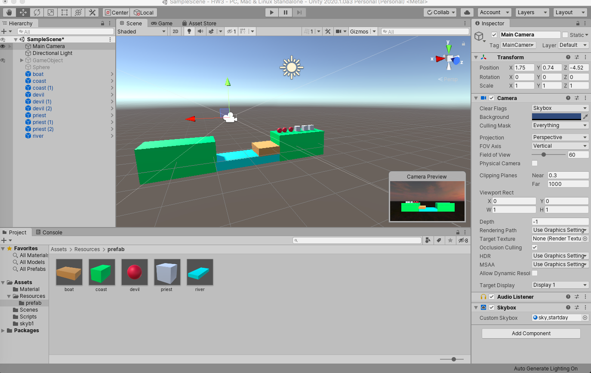
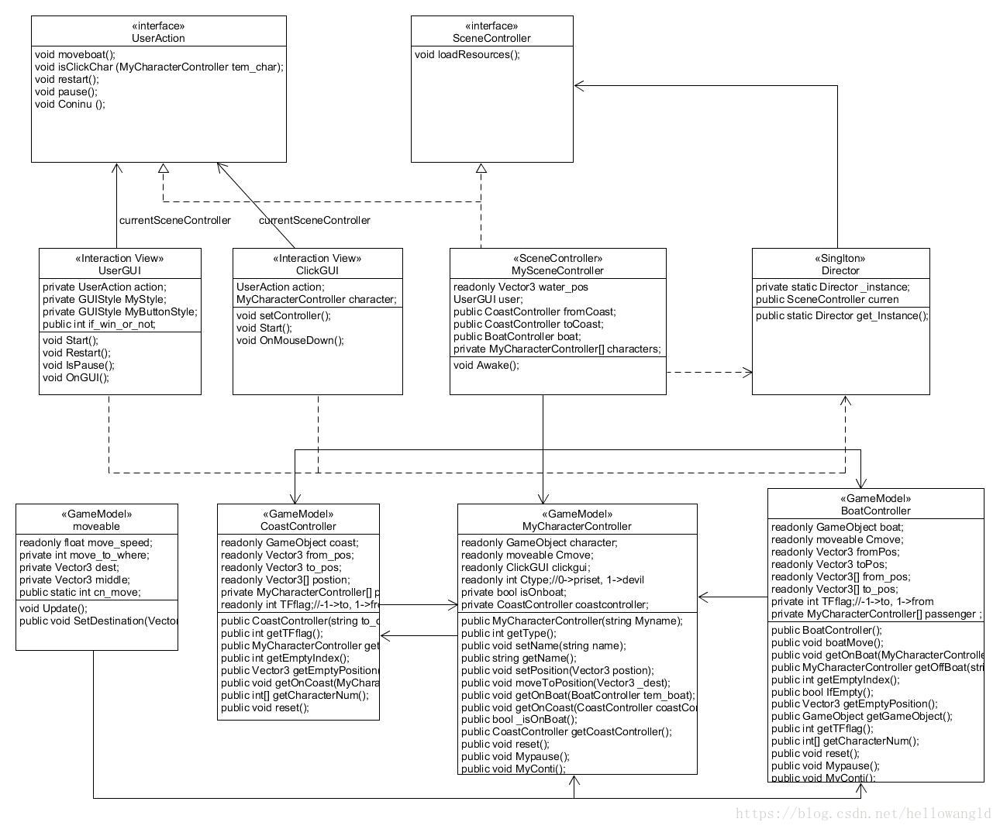

##### 17343009 陈建兵

### 1.简答题

1.游戏对象运动的本质是什么？

​	游戏对象运动的本质，是它随着页面刷新而产生的连续的运动，包括游戏对象的位置、旋转、角度、大小等。


2.请用三种方法以上方法，实现物体的抛物线运动。（如，修改Transform属性，使用向量Vector3的方法…）

​	a.修改Transform的属性

```c#
using System.Collections;
using System.Collections.Generic;
using UnityEngine;
using System;

//using Transform
public class paowuxian : MonoBehaviour
{
    // Start is called before the first frame update
    // initial speed
    public float initSpeed = 10f;
    // two direction
    private float xSpeed, ySpeed;
    // initial angle 
    public float angle = Mathf.PI / 3;
    // gravity s
    private float gravity = 9.8f;

    void Start()
    {
        // phisical formula
        xSpeed = initSpeed * Mathf.Cos(angle);
        ySpeed = initSpeed * Mathf.Sin(angle);
    }

    // Update is called once per frame
    void Update()
    {
        //motion vector per deltaTime
        Vector3 vec = new Vector3(Time.deltaTime * xSpeed, Time.deltaTime * ySpeed, 0);
        //change positon
        this.transform.position += vec;
        //ySpeed is affected by gravityss
        ySpeed -= gravity * Time.deltaTime;
    }
}

```

b.使用Vector.lerp方法（跟上面方法只有change position所用方法不同，线性插值）

```csharp
using System.Collections;
using System.Collections.Generic;
using UnityEngine;
using System;

//using Vector.lerp , most from paowuxian1.cs
public class paowuxian2 : MonoBehaviour
{
    // Start is called before the first frame update
    // initial speed
    public float initSpeed = 10f;
    // two direction
    private float xSpeed, ySpeed;
    // initial angle 
    public float angle = Mathf.PI / 3;
    // gravity s
    private float gravity = 9.8f;

    void Start()
    {
        // phisical formula
        xSpeed = initSpeed * Mathf.Cos(angle);
        ySpeed = initSpeed * Mathf.Sin(angle);
    }

    // Update is called once per frame
    void Update()
    {
        //motion vector per deltaTime
        Vector3 vec = new Vector3(Time.deltaTime * xSpeed, Time.deltaTime * ySpeed, 0);
        //change positon, only there is diffrent from paowuxian1.cs,
        //Linearly interpolates between two vectors.
        transform.position = Vector3.Lerp(transform.position, transform.position + vec, 1);
        //ySpeed is affected by gravityss
        ySpeed -= gravity * Time.deltaTime;
    }
}
```

c.使用tranform里的Translate方法

```csharp
using System.Collections;
using System.Collections.Generic;
using UnityEngine;

//using transform.Translate method
public class paowuxian3 : MonoBehaviour
{
    // Start is called before the first frame update
    // initial speed
    public float initSpeed = 10f;
    // two direction
    private float xSpeed, ySpeed;
    // initial angle 
    public float angle = Mathf.PI / 3;
    // gravity s
    private float gravity = 9.8f;
    // Use this for initialization
    void Start()
    {
        xSpeed = initSpeed * Mathf.Cos(angle);
        ySpeed = initSpeed * Mathf.Sin(angle);
    }

    // Update is called once per frame
    void Update()
    {
        //根据斜上抛运动公式
        Vector3 vec = new Vector3(Time.deltaTime * xSpeed, Time.deltaTime * ySpeed, 0);
        //translate进行平移变换
        this.transform.Translate(vec);
        //y方向改变
        ySpeed -= gravity * Time.deltaTime;
    }

}

```

3.写一个程序，实现一个完整的太阳系， 其他星球围绕太阳的转速必须不一样，且不在一个法平面上。

```csharp
using System.Collections;
using System.Collections.Generic;
using UnityEngine;

public class aroundSun : MonoBehaviour
{

    public Transform sun;
    public Transform moon;
    public Transform mercury;//水星
    public Transform venus;//金星
    public Transform earth;//地球
    public Transform mars;//火星
    public Transform jupiter;//木星
    public Transform saturn;//土星
    public Transform uranus;//天王星
    public Transform neptune;//海王星

    // Use this for initialization
    void Start()
    {
        sun.position = Vector3.zero;
        mercury.position = new Vector3(1, 0, 0);
        venus.position = new Vector3(2, 1, 0);
        earth.position = new Vector3(4, 2, 0);
        moon.position = new Vector3(3, 2, 0);
        mars.position = new Vector3(6, -2, 0);
        jupiter.position = new Vector3(7, -1, 0);
        saturn.position = new Vector3(8, -3, 0);
        uranus.position = new Vector3(9, 0, 0);
        neptune.position = new Vector3(10, 1, 1);
        mercury.localScale = new Vector3(0.1f, 0.1f, 0.1f);
        venus.localScale = new Vector3(0.1f, 0.1f, 0.1f);
        earth.localScale = new Vector3(0.2f, 0.2f, 0.2f);
        moon.localScale = new Vector3(0.05f, 0.05f, 0.05f);
        mars.localScale = new Vector3(0.15f, 0.15f, 0.15f);
        jupiter.localScale = new Vector3(0.4f, 0.4f, 0.4f);
        saturn.localScale = new Vector3(0.6f, 0.6f, 0.6f);
        uranus.localScale = new Vector3(0.3f, 0.3f, 0.3f);
        neptune.localScale = new Vector3(0.2f, 0.2f, 0.2f);
    }

    // Update is called once per frame
    void Update()
    {
        //different speed, 要选择跟上面位置正交的向量才能达到围着太阳转的感觉，分别是公转跟自转
        mercury.RotateAround(sun.position, new Vector3(0, 1, 1), 20 * Time.deltaTime);
        mercury.Rotate(new Vector3(0, 1, 1) * 5 * Time.deltaTime);

        venus.RotateAround(sun.position, new Vector3(0, 0, 1), 15 * Time.deltaTime);
        venus.Rotate(new Vector3(0, 0, 1) * Time.deltaTime);

        earth.RotateAround(sun.position, Vector3.forward, 10 * Time.deltaTime);
        earth.Rotate(Vector3.forward * 30 * Time.deltaTime);
        moon.transform.RotateAround(earth.position, Vector3.forward, 359 * Time.deltaTime);

        mars.RotateAround(sun.position, new Vector3(1, 3, 0), 9 * Time.deltaTime);
        mars.Rotate(new Vector3(1, 3, 0) * 40 * Time.deltaTime);

        jupiter.RotateAround(sun.position, new Vector3(1, 7, 0), 8 * Time.deltaTime);
        jupiter.Rotate(new Vector3(1, 7, 0) * 30 * Time.deltaTime);

        saturn.RotateAround(sun.position, new Vector3(0, 0, 1), 7 * Time.deltaTime);
        saturn.Rotate(new Vector3(0, 0, 1) * 20 * Time.deltaTime);

        uranus.RotateAround(sun.position, new Vector3(0, 2, 1), 6 * Time.deltaTime);
        uranus.Rotate(new Vector3(0, 2, 1) * 20 * Time.deltaTime);

        neptune.RotateAround(sun.position, new Vector3(0, 1, -1), 5 * Time.deltaTime);
        neptune.Rotate(new Vector3(0, 1, 1) * 30 * Time.deltaTime);
    }
}

```

### 2. 编程实践

- 阅读以下游戏脚本

> Priests and Devils
>
> Priests and Devils is a puzzle game in which you will help the Priests and Devils to cross the river within the time limit. There are 3 priests and 3 devils at one side of the river. They all want to get to the other side of this river, but there is only one boat and this boat can only carry two persons each time. And there must be one person steering the boat from one side to the other side. In the flash game, you can click on them to move them and click the go button to move the boat to the other direction. If the priests are out numbered by the devils on either side of the river, they get killed and the game is over. You can try it in many > ways. Keep all priests alive! Good luck!

程序需要满足的要求：

- play the game ( http://www.flash-game.net/game/2535/priests-and-devils.html )

- 列出游戏中提及的事物（Objects）

  Priests(牧师)，Devils(魔鬼)，Boat(船)，River(河)，Coast(岸)

- 用表格列出玩家动作表（规则表），注意，动作越少越好

  | 条件                       | 动作     | 结果                       |
  | -------------------------- | -------- | -------------------------- |
  | 右岸有人，船在右岸且未载满 | 右岸上船 | 船上多一人，右岸少了这个人 |
  | 船上有人，船在右岸         | 右岸下船 | 右岸多一人，船上少了这个人 |
  | 船上有人，船靠岸边         | 开船     | 船和船上的人驶向对岸       |
  | 船上有人，船在左岸         | 左岸下船 | 左岸多一人，船上少了这个人 |
  | 左岸有人，船在左岸且未载满 | 左岸上船 | 船上多一人，左岸少了这个人 |

- 请将游戏中对象做成预制,在 GenGameObjects 中创建 长方形、正方形、球 及其色彩代表游戏中的对象。

  

### 游戏规则

- 你要运用智慧帮助3个牧师（方块）和3个魔鬼（圆球）渡河。
- 船最多可以载2名游戏角色。
- 船上有游戏角色时，你才可以点击这个船，让船移动到对岸。
- 当有一侧岸的魔鬼数多余牧师数时（包括船上的魔鬼和牧师），魔鬼就会失去控制，吃掉牧师（如果这一侧没有牧师则不会失败），游戏失败。
- 当所有游戏角色都上到对岸时，游戏胜利。

#### 游戏架构

使用了MVC架构。

- 场景中的所有GameObject就是Model，它们受到Controller的控制，比如说牧师和魔鬼受到MyCharacterController类的控制，船受到BoatController类的控制，河岸受到CoastController类的控制。
- View就是UserGUI和ClickGUI，它们展示游戏结果，并提供用户交互的渠道（点击物体和按钮）。
- Controller：除了刚才说的MyCharacterController、BoatController、CoastController以外，还有更高一层的Controller：**FirstController（场景控制器）**，FirstController控制着这个场景中的所有对象，包括其加载、通信、用户输入。
  **最高层的Controller是Director类**，一个游戏中只能有一个实例，它控制着场景的创建、切换、销毁、游戏暂停、游戏退出等等最高层次的功能。



### GameModel
从图上我们可以看出我们需要4个GameModel，分别是：

- moveable：用于控制角色和船的移动。
- CoastController：用于控制与河岸有关的动作，比如角色上下岸，船的离开和停靠。
- MyCharacterController：用于控制6个角色的动作，比如上船，上岸等。
- BoatController：用于控制船的运动以及角色的上下船绑定。

```csharp

```


