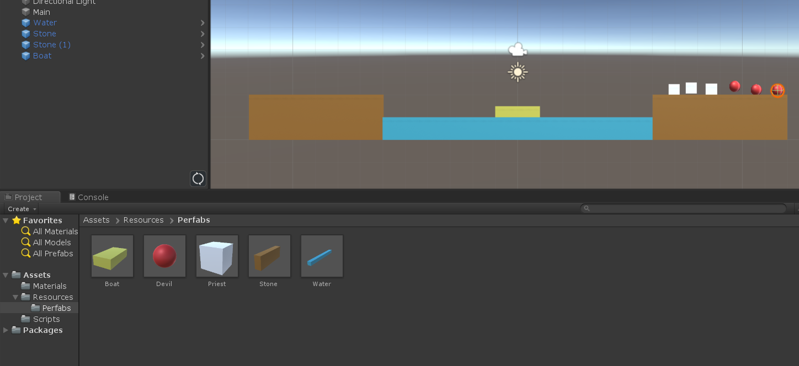

##### 17343009 陈建兵

### 1.简答题

1.游戏对象运动的本质是什么？

​	游戏对象运动的本质，是它随着页面刷新而产生的连续的运动，包括游戏对象的位置、旋转、角度、大小等。


2.请用三种方法以上方法，实现物体的抛物线运动。（如，修改Transform属性，使用向量Vector3的方法…）

​	a.修改Transform的属性

```c#
using System.Collections;
using System.Collections.Generic;
using UnityEngine;
using System;

//using Transform
public class paowuxian : MonoBehaviour
{
    // Start is called before the first frame update
    // initial speed
    public float initSpeed = 10f;
    // two direction
    private float xSpeed, ySpeed;
    // initial angle 
    public float angle = Mathf.PI / 3;
    // gravity s
    private float gravity = 9.8f;

    void Start()
    {
        // phisical formula
        xSpeed = initSpeed * Mathf.Cos(angle);
        ySpeed = initSpeed * Mathf.Sin(angle);
    }

    // Update is called once per frame
    void Update()
    {
        //motion vector per deltaTime
        Vector3 vec = new Vector3(Time.deltaTime * xSpeed, Time.deltaTime * ySpeed, 0);
        //change positon
        this.transform.position += vec;
        //ySpeed is affected by gravityss
        ySpeed -= gravity * Time.deltaTime;
    }
}

```

b.使用Vector.lerp方法（跟上面方法只有change position所用方法不同，线性插值）

```csharp
using System.Collections;
using System.Collections.Generic;
using UnityEngine;
using System;

//using Vector.lerp , most from paowuxian1.cs
public class paowuxian2 : MonoBehaviour
{
    // Start is called before the first frame update
    // initial speed
    public float initSpeed = 10f;
    // two direction
    private float xSpeed, ySpeed;
    // initial angle 
    public float angle = Mathf.PI / 3;
    // gravity s
    private float gravity = 9.8f;

    void Start()
    {
        // phisical formula
        xSpeed = initSpeed * Mathf.Cos(angle);
        ySpeed = initSpeed * Mathf.Sin(angle);
    }

    // Update is called once per frame
    void Update()
    {
        //motion vector per deltaTime
        Vector3 vec = new Vector3(Time.deltaTime * xSpeed, Time.deltaTime * ySpeed, 0);
        //change positon, only there is diffrent from paowuxian1.cs,
        //Linearly interpolates between two vectors.
        transform.position = Vector3.Lerp(transform.position, transform.position + vec, 1);
        //ySpeed is affected by gravityss
        ySpeed -= gravity * Time.deltaTime;
    }
}
```

c.使用tranform里的Translate方法

```csharp
using System.Collections;
using System.Collections.Generic;
using UnityEngine;

//using transform.Translate method
public class paowuxian3 : MonoBehaviour
{
    // Start is called before the first frame update
    // initial speed
    public float initSpeed = 10f;
    // two direction
    private float xSpeed, ySpeed;
    // initial angle 
    public float angle = Mathf.PI / 3;
    // gravity s
    private float gravity = 9.8f;
    // Use this for initialization
    void Start()
    {
        xSpeed = initSpeed * Mathf.Cos(angle);
        ySpeed = initSpeed * Mathf.Sin(angle);
    }

    // Update is called once per frame
    void Update()
    {
        //根据斜上抛运动公式
        Vector3 vec = new Vector3(Time.deltaTime * xSpeed, Time.deltaTime * ySpeed, 0);
        //translate进行平移变换
        this.transform.Translate(vec);
        //y方向改变
        ySpeed -= gravity * Time.deltaTime;
    }

}

```

3.写一个程序，实现一个完整的太阳系， 其他星球围绕太阳的转速必须不一样，且不在一个法平面上。

```csharp
using System.Collections;
using System.Collections.Generic;
using UnityEngine;

public class aroundSun : MonoBehaviour
{

    public Transform sun;
    public Transform moon;
    public Transform mercury;//水星
    public Transform venus;//金星
    public Transform earth;//地球
    public Transform mars;//火星
    public Transform jupiter;//木星
    public Transform saturn;//土星
    public Transform uranus;//天王星
    public Transform neptune;//海王星

    // Use this for initialization
    void Start()
    {
        sun.position = Vector3.zero;
        mercury.position = new Vector3(1, 0, 0);
        venus.position = new Vector3(2, 1, 0);
        earth.position = new Vector3(4, 2, 0);
        moon.position = new Vector3(3, 2, 0);
        mars.position = new Vector3(6, -2, 0);
        jupiter.position = new Vector3(7, -1, 0);
        saturn.position = new Vector3(8, -3, 0);
        uranus.position = new Vector3(9, 0, 0);
        neptune.position = new Vector3(10, 1, 1);
        mercury.localScale = new Vector3(0.1f, 0.1f, 0.1f);
        venus.localScale = new Vector3(0.1f, 0.1f, 0.1f);
        earth.localScale = new Vector3(0.2f, 0.2f, 0.2f);
        moon.localScale = new Vector3(0.05f, 0.05f, 0.05f);
        mars.localScale = new Vector3(0.15f, 0.15f, 0.15f);
        jupiter.localScale = new Vector3(0.4f, 0.4f, 0.4f);
        saturn.localScale = new Vector3(0.6f, 0.6f, 0.6f);
        uranus.localScale = new Vector3(0.3f, 0.3f, 0.3f);
        neptune.localScale = new Vector3(0.2f, 0.2f, 0.2f);
    }

    // Update is called once per frame
    void Update()
    {
        //different speed, 要选择跟上面位置正交的向量才能达到围着太阳转的感觉，分别是公转跟自转
        mercury.RotateAround(sun.position, new Vector3(0, 1, 1), 20 * Time.deltaTime);
        mercury.Rotate(new Vector3(0, 1, 1) * 5 * Time.deltaTime);

        venus.RotateAround(sun.position, new Vector3(0, 0, 1), 15 * Time.deltaTime);
        venus.Rotate(new Vector3(0, 0, 1) * Time.deltaTime);

        earth.RotateAround(sun.position, Vector3.forward, 10 * Time.deltaTime);
        earth.Rotate(Vector3.forward * 30 * Time.deltaTime);
        moon.transform.RotateAround(earth.position, Vector3.forward, 359 * Time.deltaTime);

        mars.RotateAround(sun.position, new Vector3(1, 3, 0), 9 * Time.deltaTime);
        mars.Rotate(new Vector3(1, 3, 0) * 40 * Time.deltaTime);

        jupiter.RotateAround(sun.position, new Vector3(1, 7, 0), 8 * Time.deltaTime);
        jupiter.Rotate(new Vector3(1, 7, 0) * 30 * Time.deltaTime);

        saturn.RotateAround(sun.position, new Vector3(0, 0, 1), 7 * Time.deltaTime);
        saturn.Rotate(new Vector3(0, 0, 1) * 20 * Time.deltaTime);

        uranus.RotateAround(sun.position, new Vector3(0, 2, 1), 6 * Time.deltaTime);
        uranus.Rotate(new Vector3(0, 2, 1) * 20 * Time.deltaTime);

        neptune.RotateAround(sun.position, new Vector3(0, 1, -1), 5 * Time.deltaTime);
        neptune.Rotate(new Vector3(0, 1, 1) * 30 * Time.deltaTime);
    }
}
```

### 2. 编程实践

- 阅读以下游戏脚本

> Priests and Devils
>
> Priests and Devils is a puzzle game in which you will help the Priests and Devils to cross the river within the time limit. There are 3 priests and 3 devils at one side of the river. They all want to get to the other side of this river, but there is only one boat and this boat can only carry two persons each time. And there must be one person steering the boat from one side to the other side. In the flash game, you can click on them to move them and click the go button to move the boat to the other direction. If the priests are out numbered by the devils on either side of the river, they get killed and the game is over. You can try it in many > ways. Keep all priests alive! Good luck!

程序需要满足的要求：

- play the game ( http://www.flash-game.net/game/2535/priests-and-devils.html )

- 列出游戏中提及的事物（Objects）

  Priests(牧师)，Devils(魔鬼)，Boat(船)，River(河)，Coast(岸)

- 用表格列出玩家动作表（规则表），注意，动作越少越好

  | 条件                       | 动作     | 结果                       |
  | -------------------------- | -------- | -------------------------- |
  | 右岸有人，船在右岸且未载满 | 右岸上船 | 船上多一人，右岸少了这个人 |
  | 船上有人，船在右岸         | 右岸下船 | 右岸多一人，船上少了这个人 |
  | 船上有人，船靠岸边         | 开船     | 船和船上的人驶向对岸       |
  | 船上有人，船在左岸         | 左岸下船 | 左岸多一人，船上少了这个人 |
  | 左岸有人，船在左岸且未载满 | 左岸上船 | 船上多一人，左岸少了这个人 |

- 请将游戏中对象做成预制,在 GenGameObjects 中创建 长方形、正方形、球 及其色彩代表游戏中的对象。

  

### 游戏规则

- 你要运用智慧帮助3个牧师（方块）和3个魔鬼（圆球）渡河。
- 船最多可以载2名游戏角色。
- 船上有游戏角色时，你才可以点击这个船，让船移动到对岸。
- 当有一侧岸的魔鬼数多余牧师数时（包括船上的魔鬼和牧师），魔鬼就会失去控制，吃掉牧师（如果这一侧没有牧师则不会失败），游戏失败。
- 当所有游戏角色都上到对岸时，游戏胜利。

#### 游戏架构

使用了MVC架构。

- 场景中的所有GameObject就是Model，它们受到Controller的控制，比如说牧师和魔鬼受到MyCharacterController类的控制，船受到BoatController类的控制，河岸受到CoastController类的控制。
- View就是UserGUI和ClickGUI，它们展示游戏结果，并提供用户交互的渠道（点击物体和按钮）。
- Controller：除了刚才说的MyCharacterController、BoatController、CoastController以外，还有更高一层的Controller：**FirstController（场景控制器）**，FirstController控制着这个场景中的所有对象，包括其加载、通信、用户输入。
  **最高层的Controller是Director类**，一个游戏中只能有一个实例，它控制着场景的创建、切换、销毁、游戏暂停、游戏退出等等最高层次的功能。

### GameModel
- 场景中的所有GameObject就是Model，它们受到Controller的控制，比如说牧师和魔鬼受到MyCharacterController类的控制，船受到BoatController类的控制，河岸受到CoastController类的控制。
- View就是UserGUI和ClickGUI，它们展示游戏结果，并提供用户交互的渠道（点击物体和按钮）。
- Controller：除了刚才说的MyCharacterController、BoatController、CoastController以外，还有更高一层的Controller：**FirstController（场景控制器）**，FirstController控制着这个场景中的所有对象，包括其加载、通信、用户输入。
  **最高层的Controller是Director类**，一个游戏中只能有一个实例，它控制着场景的创建、切换、销毁、游戏暂停、游戏退出等等最高层次的功能。

#### Director类：

```csharp
	//导演类，控制全局
	public class Director : System.Object {
		private static Director _instance;
		public SceneController currentSceneController { get; set; }

		public static Director getInstance() {
			if (_instance == null) {
				_instance = new Director ();
			}
			return _instance;
		}
	}
    //场景控制器
	public interface SceneController {
        //加载资源
		void loadResources ();
	}
    //用户动作
	public interface UserAction {
		void moveBoat();
		void characterIsClicked(MyCharacterController characterCtrl);
		void restart();
        //void clickrule();
	}
```

这个类最多只有一个实例，所以在任何Script中的任何地方通过`Director.getInstance()`都能得到同一个Director对象从而进行全局的操作。


#### SceneController接口：

```csharp
    //场景控制器
	public interface SceneController {
        //加载资源
		void loadResources ();
	}
```

接口需要有类继承它才能实现其中的函数。这个接口是导演控制场景控制器的渠道。在上面的Director 类中，currentSceneController （FirstController类）就是SceneController的实现，所以Director可以调用SceneController接口中的方法，来实现对场景的控制。

同样UserAction也是一个接口。实现这个接口才能对用户的输入做出反应。主要的函数是移动船、人物被点击和重新开始游戏。


#### UserGUI

```csharp
using System.Collections;
using System.Collections.Generic;
using UnityEngine;
using Com.Mygame;

public class UserGUI : MonoBehaviour {
	private UserAction action;
    //status为0表示游戏还在进行，为1表示失败，为2表示获胜
	public int status = 0;
	GUIStyle style;
	GUIStyle buttonStyle;

	void Start() {
        //实例化，设置字体参数、按钮格式
		action = Director.getInstance ().currentSceneController as UserAction;

		style = new GUIStyle();
		style.fontSize = 40;
		style.alignment = TextAnchor.MiddleCenter;

		buttonStyle = new GUIStyle("button");
		buttonStyle.fontSize = 30;
	}
	void OnGUI() {
        //失败，创建按钮 
		if (status == 1) {
			GUI.Label(new Rect(Screen.width/2-50, Screen.height/2-85, 100, 50), "游戏结束!", style);
			if (GUI.Button(new Rect(Screen.width/2-70, Screen.height/2, 140, 70), "重新开始", buttonStyle)) {
				status = 0;
				action.restart ();
			}
		} else if(status == 2) {//获胜，创建按钮
			GUI.Label(new Rect(Screen.width/2-50, Screen.height/2-85, 100, 50), "您获胜了!", style);
			if (GUI.Button(new Rect(Screen.width/2-70, Screen.height/2, 140, 70), "重新开始", buttonStyle)) {
				status = 0;
				action.restart ();
			}
		}
	}
}

```

`UserAction action`实际上是FirstController（最终的控制器类）的对象，它实现了UserAction接口。UserGUI与FirstController打交道，是通过UserAction接口的API以及成员变量status。UserGUI不知道这些API是怎么被实现的，但它知道FirstController类一定有这些方法。ClickGUI也是同样的道理，ClickGUI监测用户点击，并调用SceneController进行响应。UserGUI检测游戏状态，是否结束。

#### Moveable：

```csharp
   //对象动作
	/*-----------------------------------Moveable------------------------------------------*/
	public class Moveable: MonoBehaviour {
		//移动速度，定为只读
		readonly float move_speed = 20;

		// change frequently
		int moving_status;	// 0->不移动, 1->移动到中间位置, 2->移动到目的地
		Vector3 dest;//目的坐标
		Vector3 middle;//中间坐标

		void Update() {
            //从当前位置到目的地先移动到middlle再移动到dest
			if (moving_status == 1) {
				transform.position = Vector3.MoveTowards (transform.position, middle, move_speed * Time.deltaTime);
				if (transform.position == middle) {
					moving_status = 2;
				}
			} else if (moving_status == 2) {
				transform.position = Vector3.MoveTowards (transform.position, dest, move_speed * Time.deltaTime);
				if (transform.position == dest) {
					moving_status = 0;
				}
			}
		}
        //设置目的地坐标
		public void setDestination(Vector3 _dest) {
			dest = _dest;
			middle = _dest;
			if (_dest.y == transform.position.y) {	// 平移，说明只是船要移动
				moving_status = 2;
			}
			else if (_dest.y < transform.position.y) {	//目的地y坐标比现在低，说明是从岸上移动到船上
				middle.y = transform.position.y;
			} else {								// 目的地y坐标比现在搞，说明是从船上要移动到岸上
				middle.x = transform.position.x;
			}
			moving_status = 1;
		}

		public void reset() {
			moving_status = 0;
		}
	}
```

GameObject挂载上Moveable以后，Controller就可以通过`setDestination()`方法轻松地让GameObject移动起来。用middle来保存一个中间位置，让物体先移动到middle，再移动到dest.


#### MyCharacterController:

```csharp
  //角色控制器
	/*-----------------------------------MyCharacterController------------------------------------------*/
	public class MyCharacterController {
		readonly GameObject character;
		readonly Moveable moveableScript;
		readonly ClickGUI clickGUI;
		readonly int characterType;	// 0->priest, 1->devil

		// change frequently
		bool _isOnBoat;
		CoastController coastController;


		public MyCharacterController(string which_character) {
			//Resource.load()函数路径从Asset/Resource开始
            //根据传入的参数which_character决定创建priest还是devil
			if (which_character == "priest") {
				character = Object.Instantiate (Resources.Load ("Perfabs/Priest", typeof(GameObject)), Vector3.zero, Quaternion.identity, null) as GameObject;
				characterType = 0;
			} else {
				character = Object.Instantiate (Resources.Load ("Perfabs/Devil", typeof(GameObject)), Vector3.zero, Quaternion.identity, null) as GameObject;
				characterType = 1;
			}
            //AddComponent为这个角色对象添加Moveable组件
			moveableScript = character.AddComponent (typeof(Moveable)) as Moveable;
            //添加clickGUI组建
			clickGUI = character.AddComponent (typeof(ClickGUI)) as ClickGUI;
			clickGUI.setController (this);
		}

		public void setName(string name) {
			character.name = name;
		}

		public void setPosition(Vector3 pos) {
			character.transform.position = pos;
		}

        //利用moveable的内容到达目的地
		public void moveToPosition(Vector3 destination) {
			moveableScript.setDestination(destination);
		}

		public int getType() {	// 0->priest, 1->devil
			return characterType;
		}

		public string getName() {
			return character.name;
		}

        //上船后将当前对象的父亲改为boatCtrl船对象控制器
		public void getOnBoat(BoatController boatCtrl) {
			coastController = null;
			character.transform.parent = boatCtrl.getGameobj().transform;
			_isOnBoat = true;
		}

        //上岸后于船解除父子关系
		public void getOnCoast(CoastController coastCtrl) {
			coastController = coastCtrl;
			character.transform.parent = null;
			_isOnBoat = false;
		}

		public bool isOnBoat() {
			return _isOnBoat;
		}

		public CoastController getCoastController() {
			return coastController;
		}

		public void reset() {
			moveableScript.reset ();
			coastController = (Director.getInstance ().currentSceneController as FirstController).fromCoast;
			getOnCoast (coastController);
			setPosition (coastController.getEmptyPosition ());
			coastController.getOnCoast (this);
		}
```

总的来说这就是一个控制人物动作的类，每`new MyCharacterController()`一次，场景中就会多一个游戏角色。构造函数还将clickGUI挂载到了这个角色上，以监测“鼠标点击角色”的事件。

还定义了一些方法提供给场景控制器来调用。

除此之外还定义了其他两个控制器类，BoatController穿控制器类，CoastController岸控制器类，实现的原理跟MyCharacterController大同小异。


#### FirstController

```csharp
using System.Collections;
using System.Collections.Generic;
using UnityEngine;
using Com.Mygame;

//总控制器
public class FirstController : MonoBehaviour, SceneController, UserAction {

	readonly Vector3 water_pos = new Vector3(0,0.5F,0);


	UserGUI userGUI;//userGUI看是否游戏结束（status变量）

	public CoastController fromCoast; //2个岸控制器
	public CoastController toCoast;
	public BoatController boat;//船控制器
	private MyCharacterController[] characters;//6个角色控制器

	void Awake() {
        //导演类
		Director director = Director.getInstance ();
		director.currentSceneController = this;
		userGUI = gameObject.AddComponent <UserGUI>() as UserGUI;
		characters = new MyCharacterController[6];
		loadResources ();
	}
    //实现SceneController接口，加载对象
    public void loadResources() {
		GameObject water = Instantiate (Resources.Load ("Perfabs/Water", typeof(GameObject)), water_pos, Quaternion.identity, null) as GameObject;
		water.name = "water";

		fromCoast = new CoastController ("from");
		toCoast = new CoastController ("to");
		boat = new BoatController ();
        //加载人物
		loadCharacter ();
	}

	private void loadCharacter() {
		for (int i = 0; i < 3; i++) {
			MyCharacterController cha = new MyCharacterController ("priest");
			cha.setName("priest" + i);
			cha.setPosition (fromCoast.getEmptyPosition ());
			cha.getOnCoast (fromCoast);
			fromCoast.getOnCoast (cha);

			characters [i] = cha;
		}

		for (int i = 0; i < 3; i++) {
			MyCharacterController cha = new MyCharacterController ("devil");
			cha.setName("devil" + i);
			cha.setPosition (fromCoast.getEmptyPosition ());
			cha.getOnCoast (fromCoast);
			fromCoast.getOnCoast (cha);

			characters [i+3] = cha;
		}
	}

    //实现Useraction接口，移动船
	public void moveBoat() {
		if (boat.isEmpty ())
			return;
		boat.Move ();
		userGUI.status = check_game_over ();
	}

    //实现Useraction接口，人物被点击动作
	public void characterIsClicked(MyCharacterController characterCtrl) {
        //人物对象在船上，送上岸
		if (characterCtrl.isOnBoat ()) {
			CoastController whichCoast;
			if (boat.get_to_or_from () == -1) { // to->-1; from->1
				whichCoast = toCoast;
			} else {
				whichCoast = fromCoast;
			}
            //将人物从船上抹去
			boat.GetOffBoat (characterCtrl.getName());
            //移动人物
			characterCtrl.moveToPosition (whichCoast.getEmptyPosition ());
            //人物登陆
			characterCtrl.getOnCoast (whichCoast);
            //陆地控制器接收
			whichCoast.getOnCoast (characterCtrl);

		} else {	//人物在岸上								// character on coast
			CoastController whichCoast = characterCtrl.getCoastController ();
            //船满载
			if (boat.getEmptyIndex () == -1) {		// boat is full
				return;
			}
            //点击船对面岸上的人无效
			if (whichCoast.get_to_or_from () != boat.get_to_or_from ())	// boat is not on the side of character
				return;
            //岸控制器释放
			whichCoast.getOffCoast(characterCtrl.getName());
            //人物移动
			characterCtrl.moveToPosition (boat.getEmptyPosition());
            //上船
			characterCtrl.getOnBoat (boat);
            //船控制器接收
			boat.GetOnBoat (characterCtrl);
		}
        //每次点击检查是否结束
		userGUI.status = check_game_over ();
	}

    //检查游戏是否结束，失败返回1，成功返回2，还能继续返回0
	int check_game_over() {	// 0->not finish, 1->lose, 2->win
		int from_priest = 0;
		int from_devil = 0;
		int to_priest = 0;
		int to_devil = 0;
        
		int[] fromCount = fromCoast.getCharacterNum ();
		from_priest += fromCount[0];
		from_devil += fromCount[1];

		int[] toCount = toCoast.getCharacterNum ();
		to_priest += toCount[0];
		to_devil += toCount[1];

		if (to_priest + to_devil == 6)		// win
			return 2;

		int[] boatCount = boat.getCharacterNum ();
		if (boat.get_to_or_from () == -1) {	// boat at toCoast
			to_priest += boatCount[0];
			to_devil += boatCount[1];
		} else {	// boat at fromCoast
			from_priest += boatCount[0];
			from_devil += boatCount[1];
		}
		if (from_priest < from_devil && from_priest > 0) {		// lose
			return 1;
		}
		if (to_priest < to_devil && to_priest > 0) {
			return 1;
		}
		return 0;			// not finish
	}
    //重置
	public void restart() {
		boat.reset ();
		fromCoast.reset ();
		toCoast.reset ();
		for (int i = 0; i < characters.Length; i++) {
			characters [i].reset ();
		}
	}
}

```

这个类继承了MonoBehaviour, SceneController, UserAction 三个类，并实现其中的接口函数，是挂在到空Object上面的script。


### 总结

看懂这份代码其实不难，但是自己做起来发现有很多细节要处理，比如空位置的选取、移动的路线、状态的改变，规则的处理等。

-----

参考了老师给的博客：[学习Unity(5)小游戏实例——牧师与魔鬼](https://www.jianshu.com/p/07028b3da573)

因为太菜只能照着打然后理解。。。