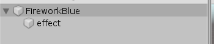
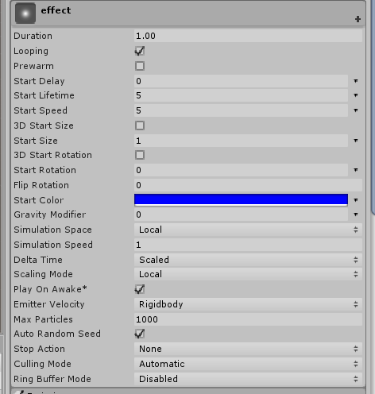
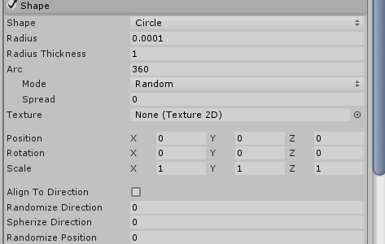
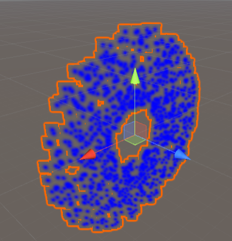
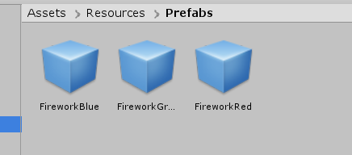
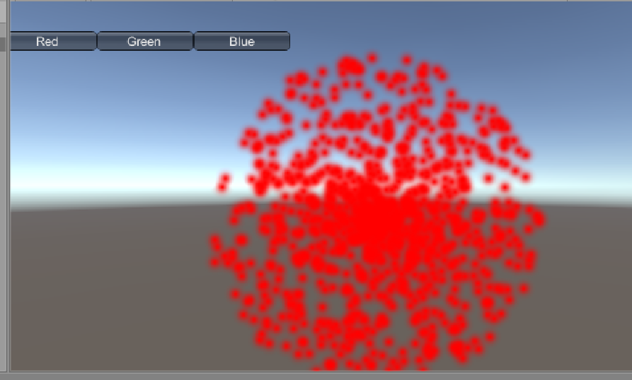

### 简单粒子系统

根据课上的内容做一个简单的粒子系统(非常简单)

#### 1.创建一个GameObject，创建子对象effect



如果需要多个效果组合，可以添加多个effect，这里只用了一个effect

#### 2.对effect里的参数进行调整



主要属性没怎么修改，改了StartColor



修改shape使得粒子圆形放射



有材料的话可以修改这里Material和Texture

到此一个简单烟花粒子系统就造成了

#### 3.保存为预制

修改颜色，保存成三个颜色的烟花



#### 4.简单用代码使用预制的烟花

三个按钮，呈现三个不同颜色的烟花

```csharp
using System.Collections;
using System.Collections.Generic;
using UnityEngine;

public class UserGUI : MonoBehaviour
{
    private GameObject firework;

    // Start is called before the first frame update
    void Start()
    {
        firework = Instantiate(Resources.Load<GameObject>("Prefabs/FireworkRed"), Vector3.zero, Quaternion.identity);
    }

    
    void OnGUI()
    {
        if(GUI.Button(new Rect(50, 50, 100, 20), "Red"))
        {
            Destroy(firework);
            firework = Instantiate(Resources.Load<GameObject>("Prefabs/FireworkRed"), Vector3.zero, Quaternion.identity);
        }
        if (GUI.Button(new Rect(150, 50, 100, 20), "Green"))
        {
            Destroy(firework);
            firework = Instantiate(Resources.Load<GameObject>("Prefabs/FireworkGreen"), Vector3.zero, Quaternion.identity);
        }
        if (GUI.Button(new Rect(250, 50, 100, 20), "Blue"))
        {
            Destroy(firework);
            firework = Instantiate(Resources.Load<GameObject>("Prefabs/FireworkBlue"), Vector3.zero, Quaternion.identity);
        }
    }
}

```



